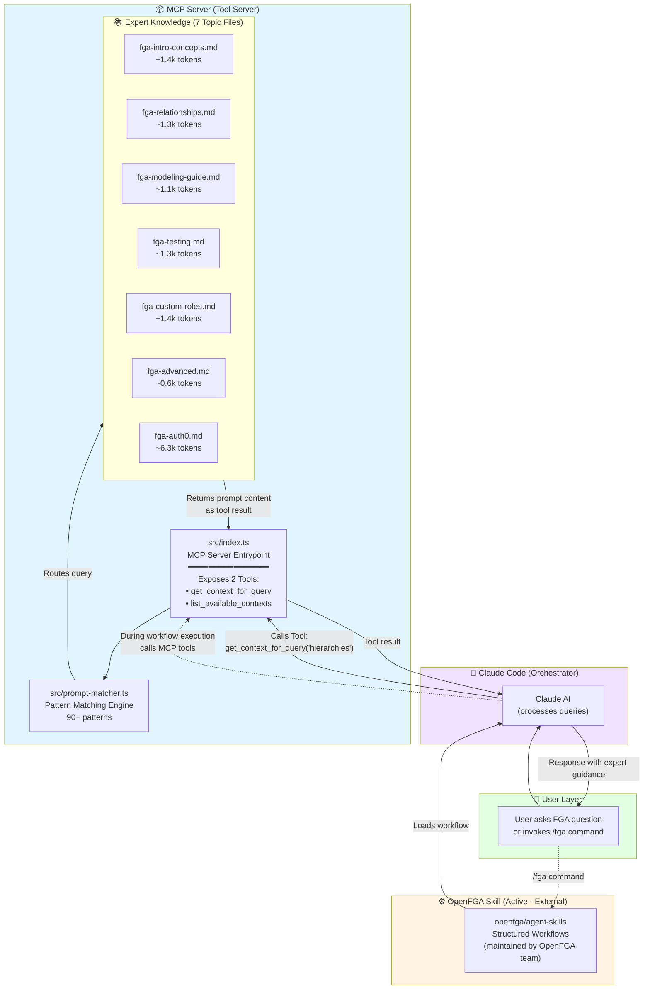
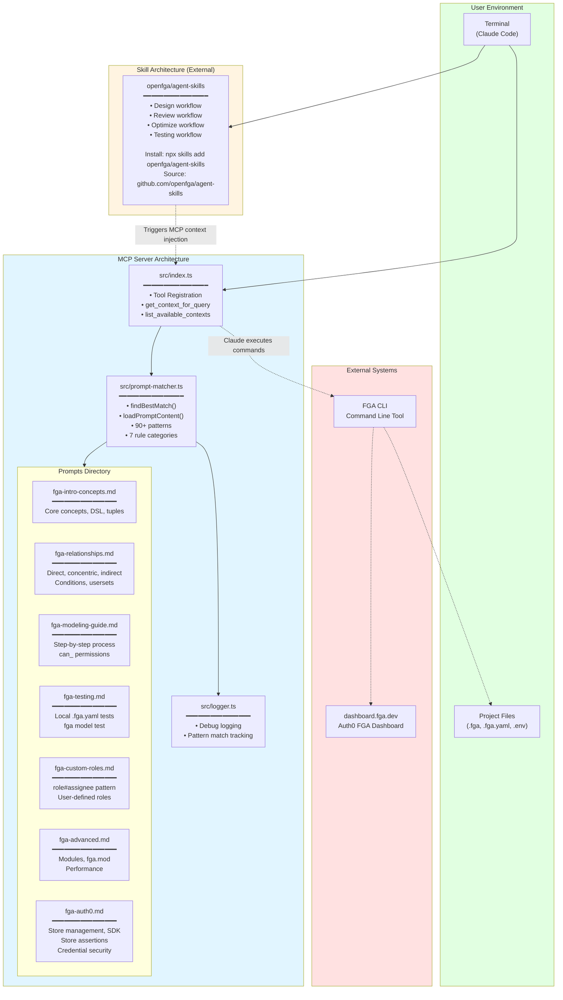
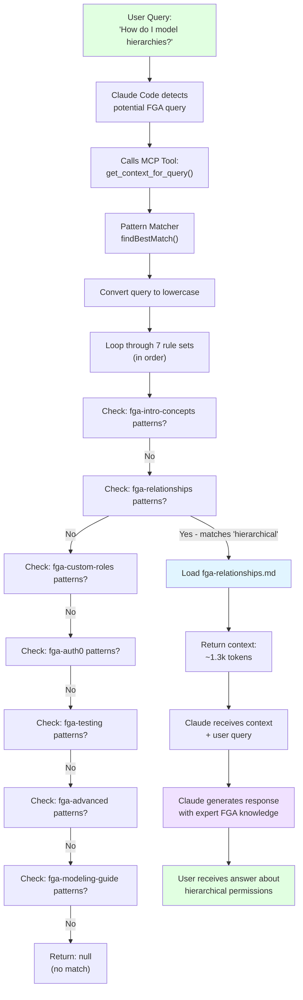
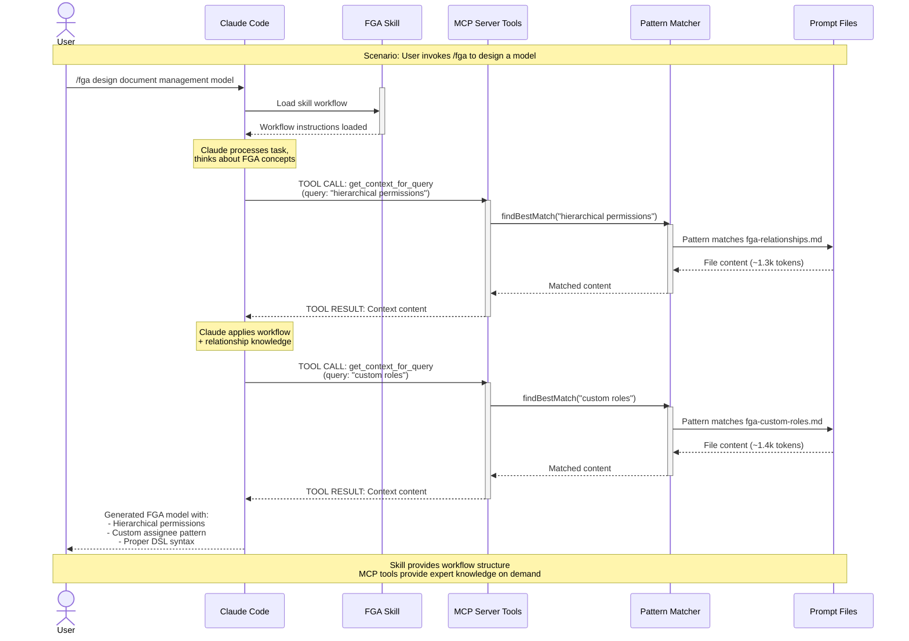
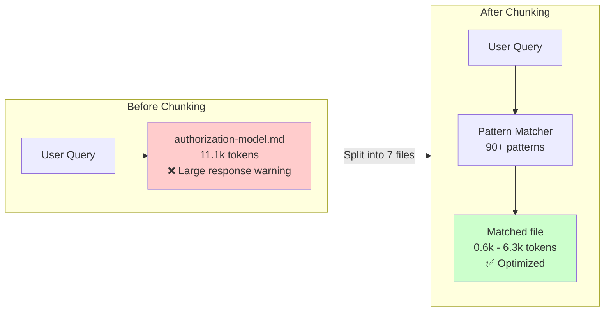
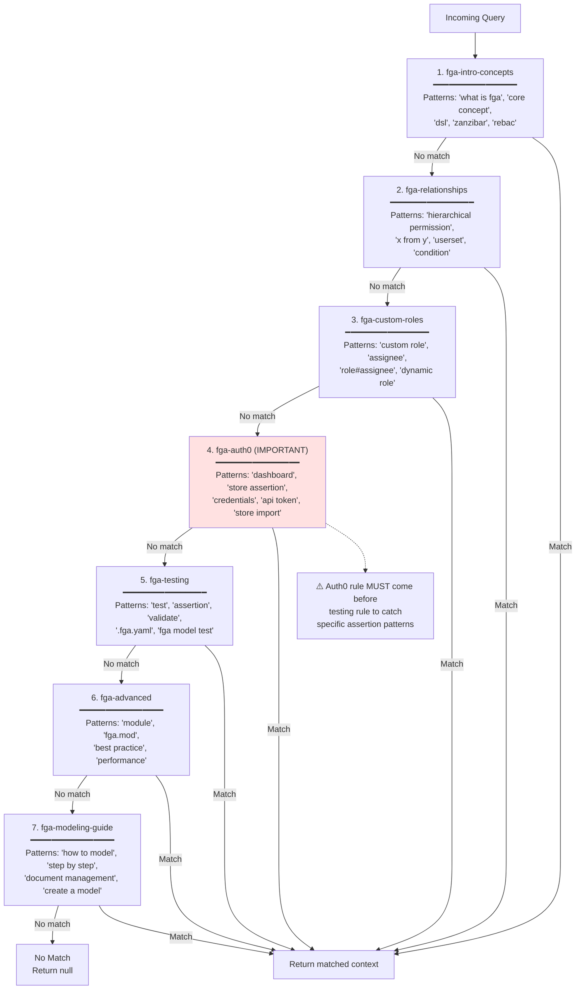

# FGA MCP Server & Skill Architecture

## Overview Diagram



## Detailed Component Diagram



## Pattern Matching Flow



## MCP Server + Skill Collaboration



## Skill Invocation Flow

```mermaid
flowchart TD
    Start["User types: /fga design a blog platform"]

    Start --> SkillDetect["Claude Code detects /fga command"]

    SkillDetect --> LoadSkill["Load openfga/agent-skills<br/>Active workflow instructions"]

    LoadSkill --> ParseCmd["Parse command:<br/>task = 'design a blog platform'"]

    ParseCmd --> WorkflowStart["Skill: Start design workflow<br/>1. Ask clarifying questions<br/>2. Identify resources<br/>3. Model relationships<br/>4. Define permissions"]

    WorkflowStart --> Step1["Claude asks user:<br/>'What resources need protection?'"]

    Step1 --> UserResp["User: posts, comments, users"]

    UserResp --> MCPInject1["MCP automatically injects<br/>fga-modeling-guide.md"]

    MCPInject1 --> Generate1["Claude generates initial model<br/>with types for post, comment, user"]

    Generate1 --> Step2["Skill: Define relationships"]

    Step2 --> MCPInject2["MCP automatically injects<br/>fga-relationships.md"]

    MCPInject2 --> Generate2["Claude adds relations:<br/>author, commenter, reader"]

    Generate2 --> Step3["Skill: Offer to create tests"]

    Step3 --> MCPInject3["MCP automatically injects<br/>fga-testing.md"]

    MCPInject3 --> Final["Claude generates .fga.yaml<br/>test file with assertions"]

    Final --> Complete["Complete model delivered:<br/>• Model file<br/>• Test file<br/>• Next steps"]

    style Start fill:#e1ffe1
    style LoadSkill fill:#fff4e1
    style MCPInject1 fill:#e1f5ff
    style MCPInject2 fill:#e1f5ff
    style MCPInject3 fill:#e1f5ff
    style Complete fill:#e1ffe1
```



## Token Efficiency Comparison



## File Organization

```mermaid
graph TD
    Root["fga-mcp-skills-quickstart/"]

    Root --> Src["src/"]
    Root --> Prompts["prompts/"]
    Root --> SkillDir["skill (external)"]
    Root --> Tests["test files"]
    Root --> Docs["documentation"]

    Src --> Index["index.ts<br/>(MCP server)"]
    Src --> Matcher["prompt-matcher.ts<br/>(pattern engine)"]
    Src --> Log["logger.ts"]

    Prompts --> P1["fga-intro-concepts.md"]
    Prompts --> P2["fga-relationships.md"]
    Prompts --> P3["fga-modeling-guide.md"]
    Prompts --> P4["fga-testing.md"]
    Prompts --> P5["fga-custom-roles.md"]
    Prompts --> P6["fga-advanced.md"]
    Prompts --> P7["fga-auth0.md"]
    Prompts --> PBackup["authorization-model.md.backup"]

    SkillDir["External Skill<br/>openfga/agent-skills"]

    Tests --> UAT["test-uat.js<br/>(26 automated tests)"]
    Tests --> UATGuide["UAT-GUIDE.md"]
    Tests --> UATQuick["UAT-QUICKSTART.md"]

    Docs --> Readme["README.md"]
    Docs --> Setup["CLAUDE-CODE-SETUP.md"]
    Docs --> Chunking["CHUNKING-SUMMARY.md"]
    Docs --> Demo["DEMO-SCRIPT.md"]
    Docs --> ClaudeMD[".claude.md"]

    style Src fill:#e1f5ff
    style Prompts fill:#e1f5ff
    style SkillDir fill:#fff4e1
    style Tests fill:#e1ffe1
    style Docs fill:#f0f0f0
```



## Pattern Matching Priority



## MCP Tools Exposed

The MCP server exposes **2 tools** that Claude Code can call:

### Tool 1: `get_context_for_query`

**Purpose**: Get relevant FGA expert context for a query

**Input**:
```json
{
  "query": "How do I model hierarchical permissions?"
}
```

**Process**:
1. Pattern matcher searches for matching patterns in query
2. Routes to appropriate prompt file (e.g., fga-relationships.md)
3. Loads file content

**Output**:
```
Context found for query: "How do I model hierarchical permissions?"

Using prompt: Defining relationships in OpenFGA

---

[Full content of fga-relationships.md (~1.3k tokens)]
```

### Tool 2: `list_available_contexts`

**Purpose**: List all available context topics

**Input**: None

**Output**:
```
Available Context Prompts:

**OpenFGA introduction and core concepts**
File: fga-intro-concepts.md
Patterns: what is openfga, core concept, dsl, ...

**Defining relationships in OpenFGA**
File: fga-relationships.md
Patterns: hierarchical permission, x from y, ...

[... 5 more topics]
```

**When Claude calls these tools:**
- When user asks FGA-related questions
- During `/fga` skill execution to get specific knowledge
- When Claude needs to refresh context about a particular topic

## Key Architectural Principles

### 1. Tool Server vs Skill

- **MCP Server (Tool Server)**: Exposes tools that Claude Code calls
  - Provides 2 tools: `get_context_for_query`, `list_available_contexts`
  - Claude Code decides when to call these tools based on query content
  - Returns 0.6k-6.3k tokens per tool call
  - User never directly invokes the tools

- **Skill (Active Workflow)**: User explicitly invokes with `/openfga`
  - Maintained by the OpenFGA team at [openfga/agent-skills](https://github.com/openfga/agent-skills)
  - Provides structured workflows loaded into Claude's context
  - Guides multi-step processes
  - During execution, Claude may call MCP tools to get expert knowledge

### 2. Pattern Matching Order

More specific patterns must come first:
- "create module" before "how do i create"
- "store assertion" before "assertion"
- auth0 rule (specific) before testing rule (generic)

### 3. Token Optimization

- **Before**: 11.1k tokens → Large MCP response warnings
- **After**: 0.6k-6.3k tokens (70-95% reduction)
- Smart routing ensures minimal, relevant context

### 4. Testing Strategy

- **Local tests** (.fga.yaml): Ephemeral, development/CI
- **Store assertions** (fga.yaml): Persistent, dashboard-visible
- Clear separation in prompts (testing.md vs auth0.md)

### 5. Credential Security

- Never hardcode credentials in commands
- Always use environment variable references ($FGA_STORE_ID)
- Automatically offer to create .env files
- Remind about token rotation

## Success Metrics

- ✅ 70-95% token reduction per query
- ✅ No "Large MCP response" warnings
- ✅ 26/26 automated tests passing
- ✅ 90+ patterns across 7 topic areas
- ✅ Clear separation: local tests vs store assertions
- ✅ Secure credential handling built-in
